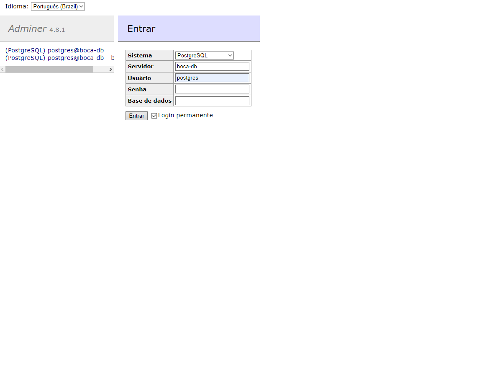
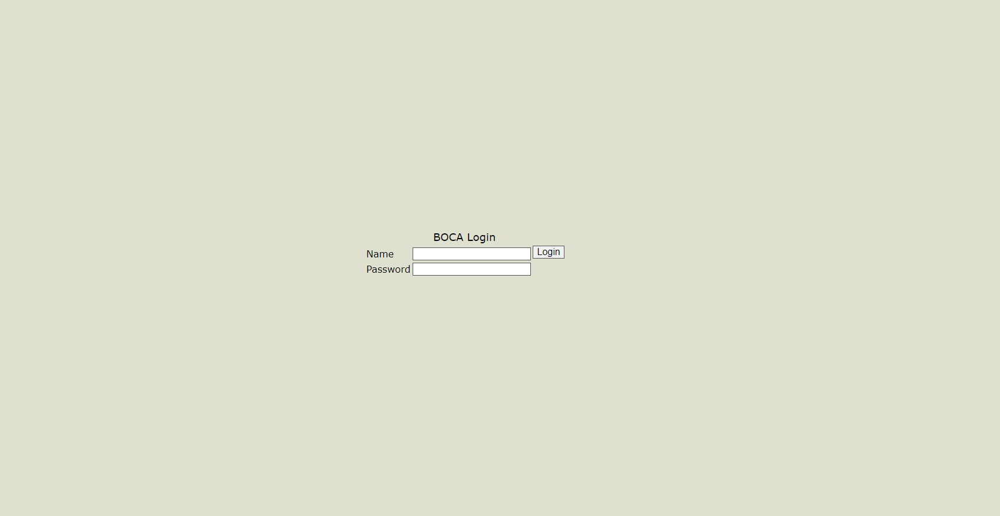
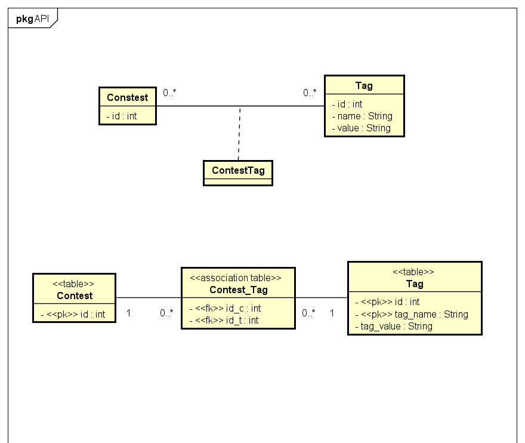

# Boca - Aplicação Dockerizada com Melhorias

## Tópicos

1. [Descrição](#descrição)
2. [Instruções de Uso](#instruções-de-uso)
   - [Execução](#execução)
   - [Parada](#parada)
3. [Acesso à Aplicação](#acesso-à-aplicação)
   - [Login do Adminer](#login-do-adminer)
   - [Primeiro Login no Boca](#primeiro-login-no-boca)
4. [Arquitetura do Sistema](#arquitetura-do-sistema)
5. [API Endpoints](#api-endpoints)
   - [Exemplos](#exemplos)
6. [Testes Automatizados](#testes-automatizados)
7. [Licença](#licença)
8. [Decisões de Projeto](#decisões-de-projeto)
9. [Diagrama](#diagrama)
10. [Autores](#autores)


## Descrição
O projeto Boca consiste em uma aplicação melhorada, baseada em um código pré-existente localizado na pasta "boca-docker". Essa aplicação é containerizada, utilizando Docker e Node.js como pré-requisitos essenciais para sua execução. Sua melhoria consiste em implementar o controle de tags entre os contests da aplicação.

## Instruções de Uso

1. Certifique-se de ter o Docker e o Node.js instalados em seu sistema:
   <p align="left"> <a href="https://www.docker.com/" target="_blank" rel="noreferrer">  </a> <a href="https://nodejs.org" target="_blank" rel="noreferrer">  </a> </p>
2. Navegue até a pasta "boca-docker".

### Execução
Para iniciar a aplicação, execute o seguinte comando no terminal:

```bash
docker compose -f docker-compose.yml -f docker-compose.prod.yml -f docker-compose.api.yml up -d --build
```

ou execute o ShellScript ```rundocker.sh```.

Este comando irá inicializar o boca, o banco de dados e a API em Node.js.

### Parada
Para encerrar a aplicação, utilize o seguinte comando:

```bash
docker compose -f docker-compose.yml -f docker-compose.prod.yml -f docker-compose.api.yml down
```

ou execute o ShellScript ```stopdocker.sh```.

#### OBS: Caso queira executar via ShellScript no Linux, garanta que o arquivo tenha permissão de execução. Para isso, execute o seguinte comando:

```bash
sudo chmod +x rundocker.sh stopdocker.sh
```

## Acesso à Aplicação
- Acesse a aplicação "boca" no navegador através do link: http://localhost:8000/boca.
- Acesse o adminer no navegador através do link: http://localhost:8080.


### Login do Adminer

Para realizar o login no Adminer:

- **Sistema:** PostgreSQL
- **Servidor:** boca-db
- **Usuário:** postgres
- **Senha:** superpass




### Primeiro Login no Boca

Para realizar o login no Boca:

- **Name:** system
- **Password:** boca

Após a criação de um Contest, pode ser feito login com:

- **Name:** admin
- **Password:** boca




## Arquitetura do Sistema

Para a arquitetura, adotamos o padrão MVC (Model-View-Controller) para a camada de interface do usuário. Neste contexto, a view representa o HttpRequest feito pelo usuário, enquanto o controlador atua como receptor do request.

- [Mais sobre o padrão MVC](https://www.treinaweb.com.br/blog/o-que-e-mvc)

Na camada de lógica de negócios (CLN), implementamos o padrão Camada de Serviço. Aqui, encontram-se as classes de domínio (para o caso, apenas a TAG) e um pacote de serviços responsáveis por executar as tarefas.

- [Mais sobre o padrão Camada de Serviço](https://martinfowler.com/eaaCatalog/serviceLayer.html)

Para a camada de acesso a dados (CGD), utilizamos o padrão DAO (Data Access Object), que é responsável por se comunicar com o banco de dados e executar as queries.

- [Mais sobre o padrão DAO](https://dev.to/diariodeumacdf/padroes-dao-e-repository-13nj)


## API Endpoints

Para utilizar a API, utilize os seguintes endpoints:

O webservice, por padrão, está em ```localhost:49160```.


| Endpoint                                 | Método | Funcionalidade                                            | Corpo da Requisição (Request Body) (JSON)                                       |
|------------------------------------------|--------|----------------------------------------------------------|-------------------------------------------------------------------------|
| `<webservice>/api/contest/:id_c/tag`      | GET    | Lista as tags associadas à competição dada pelo `id_c`   | -                                                                       |
| `<webservice>/api/contest/:id_c/tag`      | POST   | Cadastra uma nova tag associada à competição dada pelo `id_c` | { "tag_name": "novo_nome", "tag_value": "novo_valor" }                 |
| `<webservice>/api/contest/:id_c/tag/:id_t`| GET    | Mostra a tag dada pelo `id_t` no contest `id_c`          | -                                                                       |
| `<webservice>/api/contest/:id_c/tag/:id_t`| PUT    | Atualiza a tag dada pelo `id_t` no contest `id_c`        | { "tag_name": "novo_nome", "tag_value": "novo_valor" }                 |
| `<webservice>/api/contest/:id_c/tag/:id_t`| DELETE | Remove a tag dada pelo `id_t` no contest `id_c`         | -                                                                       |

### Exemplos:
```GET: localhost:49160/api/contest/3/tag/```: Lista as tags da competição cujo ```id = 3```


## Testes Automatizados:


Para os testes, foram utilizadas as frameworks jest + supertest. 


A execução dos testes pode ser feita navegando ate a pasta "docker/dev/api" e, em seguida, executar o seguinte comando:

```bash
npm run test
```

Para a execução dos testes, é recomendado que o banco esteja zerado (Em seu estado inicial). É necessário que o servidor esteja rodando também.
Ele utiliza apenas os dados iniciais do banco e os dados que cria. Durante os testes, o script exclui esses dados para que possa sempre realizá-los. 


## Licença
Este projeto é licenciado sob os termos da MIT License. Veja o arquivo LICENSE para mais detalhes:

[](LICENSE)

## Decisões de Projeto
- A API foi modularizada no padrão MVC, para facilitar a manutenção e o entendimento do código, além de facilitar a implementação de novas funcionalidades.
- Foi utilizado TypeScript para a implementação da API, pois permite a utilização em conjunto com o Node.js, além de facilitar a manutenção do código.
- Foram criadas duas tabelas, uma para armazenar as tags e outra para armazenar as relações entre as tags e os contests.
- A tabela **tags** possui os seguintes campos: ```tag_id```, ```tag_name``` e ```tag_value```, onde ```tag_id``` é a chave primária da tabela, e o nome e valor são campos únicos. 
- A tabela **contest_tags** possui os seguintes campos: ```contest_id``` e ```tag_id```, onde ambos são chaves estrangeiras para as tabelas contesttable e tags, respectivamente. Ambas formam a chave primária da tabela contest_tags.
- Foram criados testes automatizados, utilizando o Jest e o supertest, para garantir e testar o funcionamento correto da API.
- Na descrição do problema é entendido que outras entidades, como usuario, podem ter ```Tags```.Vimos, então, dois caminhos: poderiamos implementar uma entidade fraca que se relacionaria diretamente com sua entidade forte. Ex: ```Contest <- TagContest```, em que a cardinalidade seria ```1 <- 0..*```. O outro caminho, que foi o escolhido, consistia em considerar ```Tag``` uma entidade forte que pode se relacionar com quaisquer outras entidades, no qual esse relacionamento é feito por meio de tabelas associativas.
- Tivemos um problema ao acessar o boca, de não ter permissão de inclusão de registros em uma sequence de logs do banco. Desta forma, foi necessário buscar uma solução e incluir nos scripts de inicialização do banco uma alteração de permissão para todos os usuários poderem registrar os logs.

## Diagrama





## Autores

Este projeto foi desenvolvido por:

- [Arthur Tartaglia Pereira](https://github.com/ArthurTPereira)
- [João Gabriel de Barros Rocha](https://github.com/JoaoGBarros)
